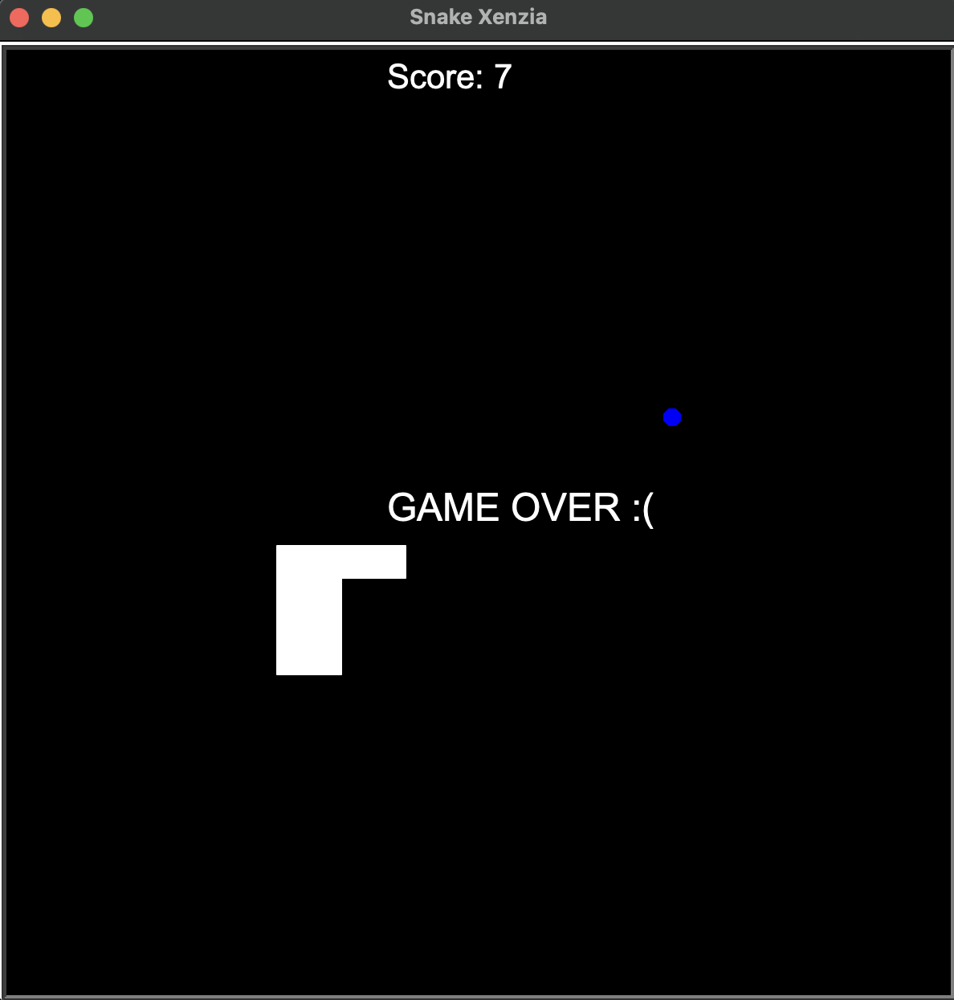

# Snake Xenzia

A classic Snake game implemented in Python using the turtle graphics library. Eat food, grow your snake, and avoid collisions with the wall or yourself!

## Features
- Responsive keyboard controls (arrow keys)
- Randomly spawning food
- Score tracking and display
- Game over detection for wall and self-collision
- Clean, modular code with OOP (Snake, Food, Scoreboard classes)

## How to Play
- Run `main.py` in your Python environment.
- Use the arrow keys to control the snake's direction.
- Eat the blue food to grow and increase your score.
- Avoid hitting the walls or your own tail.

## Requirements
- Python 3.6+
- Standard library only (no external dependencies)

## Files
- `main.py` — Main game loop and setup
- `snake.py` — Snake class (movement, growth, direction)
- `food.py` — Food class (random placement)
- `scoreboard.py` — Scoreboard class (score display and game over)

## Example

---
Inspired by the classic Snake game and built for learning Python OOP and turtle graphics.
